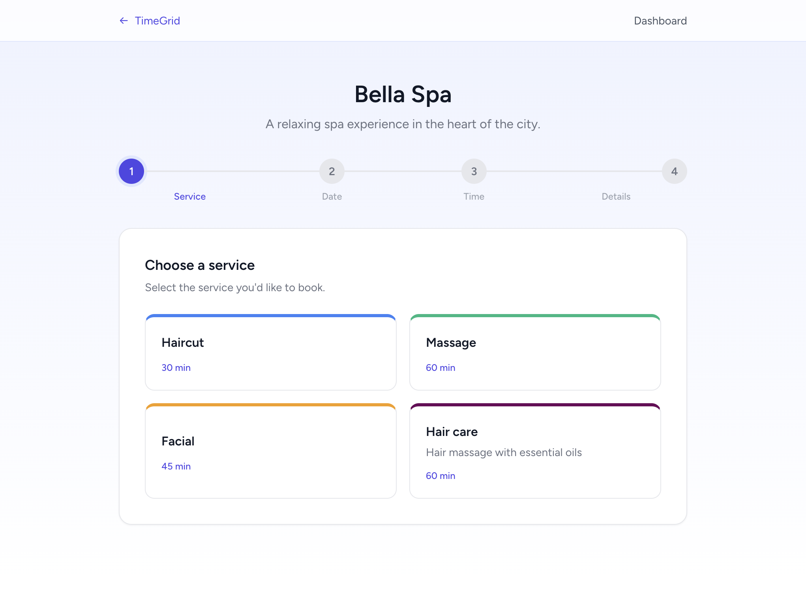
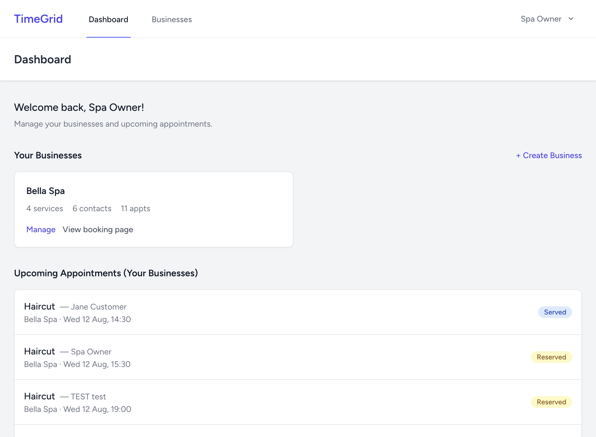
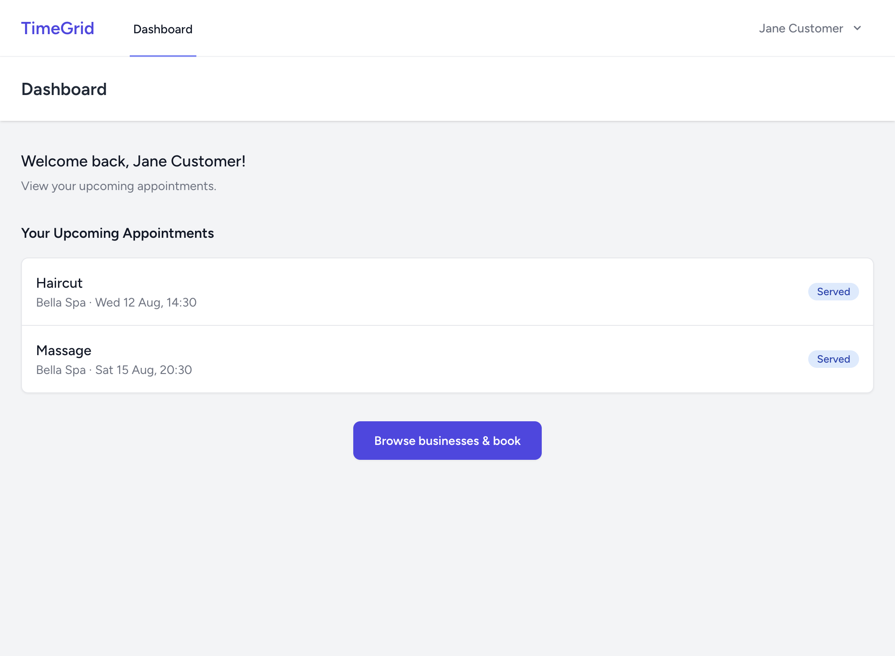
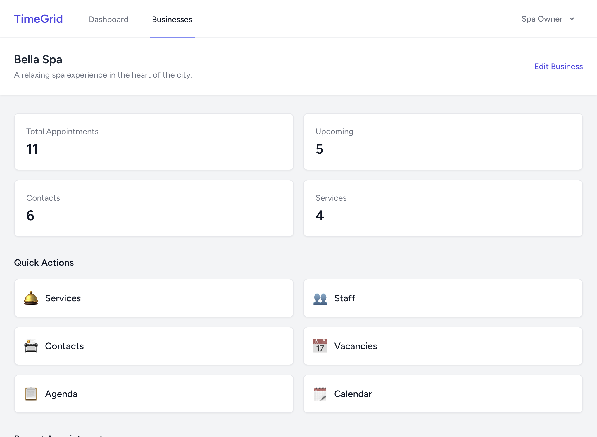
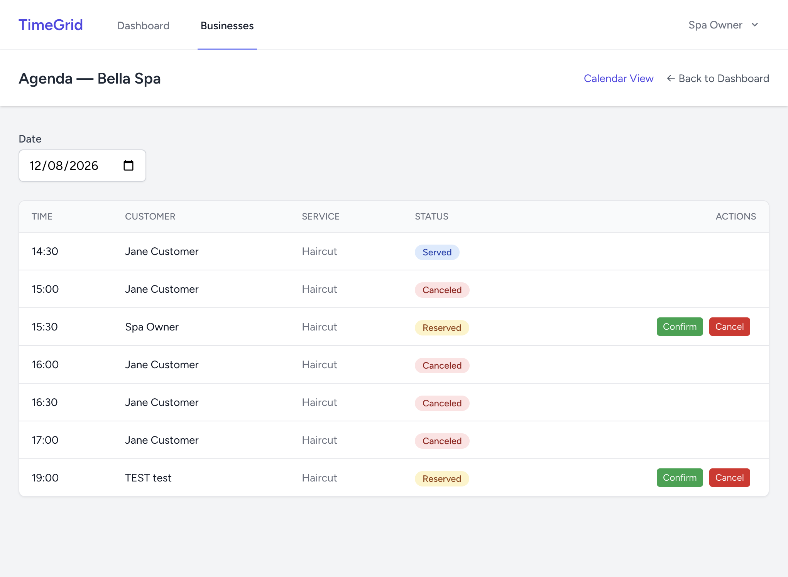
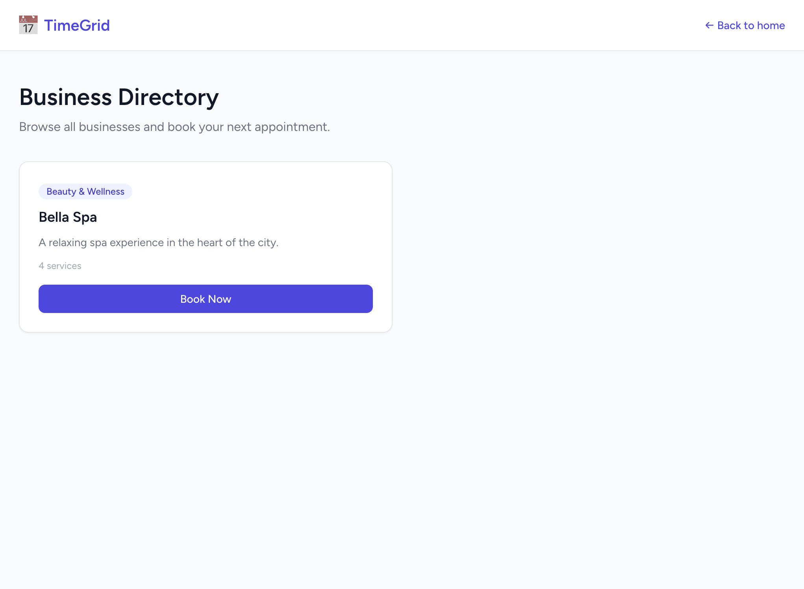
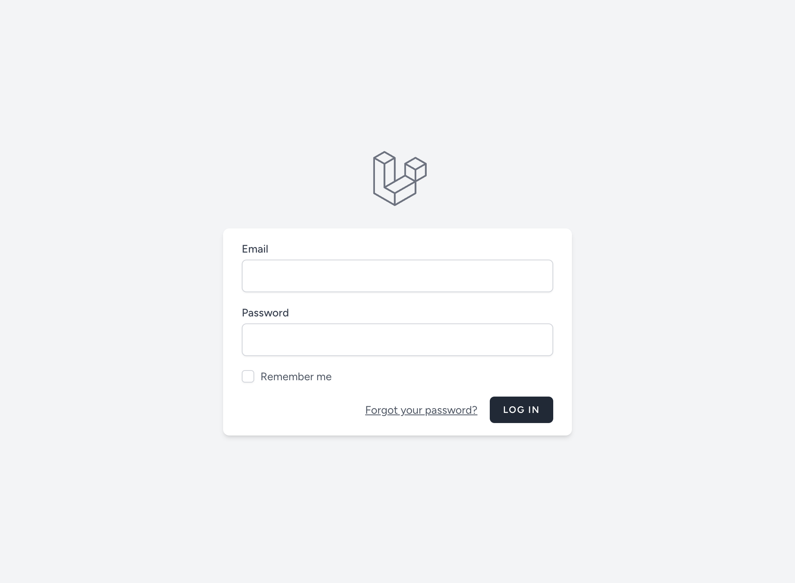

# TimeGrid

Online appointment booking platform. Businesses publish their available time slots, customers browse and book appointments.

Modernized from the original [timegridio/timegrid](https://github.com/timegridio/timegrid) — rewritten with **Laravel 11**, **Inertia.js**, **React 19**, **TypeScript**, and **Tailwind CSS**.

---

## Screenshots

<table>
<tr>
<td width="50%">

**Landing Page**


</td>
<td width="50%">

**Booking Wizard**



</td>
</tr>
<tr>
<td>

**Owner Dashboard**



</td>
<td>

**Customer Dashboard**



</td>
</tr>
<tr>
<td>

**Business Management**



</td>
<td>

**Agenda**



</td>
</tr>
<tr>
<td>

**Business Directory**



</td>
<td>

**Login**



</td>
</tr>
</table>

---

## Tech Stack

| Layer | Technology |
|-------|-----------|
| Backend | Laravel 11 (PHP 8.2+) |
| Frontend | React 19 + TypeScript |
| Routing | Inertia.js |
| Styling | Tailwind CSS |
| Build | Vite |
| Database | MySQL 8 / SQLite |
| Auth | Laravel Breeze |

## Features

- **Public booking page** — customers browse services, pick date/time, and book (login required)
- **Role-based dashboards** — owners manage businesses, customers view their appointments
- **Vacancy-driven availability** — owners define time windows, system generates bookable slots
- **Appointment lifecycle** — reserve, confirm, serve, or cancel with enforced state transitions
- **Multi-step booking wizard** — 4-step flow with real-time availability checks
- **Business management** — services, staff, contacts, vacancies, agenda, calendar

## User Roles

| Role | Can Do |
|------|--------|
| **Root** | Everything |
| **Owner** | Create/manage businesses, services, staff, vacancies, agenda |
| **Customer** | Browse businesses, book appointments, view own appointments |

## Appointment State Machine

```
reserved ──→ confirmed ──→ served
    │              │
    └──→ canceled ←┘
```

## Getting Started

### One-command AI setup (Cursor / AI agents)

Clone the repo, open it in [Cursor](https://cursor.com), and type:

```
/setup
```

The AI will automatically install prerequisites, dependencies, set up the database, seed demo data, build the frontend, and start the server. No manual steps needed.

For development mode with hot-reload:

```
/dev
```

See [`.cursorrules`](.cursorrules) for the full setup instructions the AI follows.

### Manual Setup

```bash
cd modern
composer install
npm install
cp .env.example .env
php artisan key:generate
touch database/database.sqlite
php artisan migrate
php artisan db:seed --class=DemoSeeder
npm run build
php artisan serve
```

Open [http://localhost:8000](http://localhost:8000).

### Demo Accounts

| Role | Email | Password |
|------|-------|----------|
| Root | root@timegrid.io | password |
| Owner | owner@timegrid.io | password |
| Customer | customer@timegrid.io | password |

## Architecture

```
modern/
├── app/
│   ├── Enums/              # UserRole, AppointmentStatus, BookingStrategy
│   ├── Http/Controllers/   # Inertia controllers + API v1
│   ├── Models/             # Business, Service, Staff, Contact, Vacancy, Appointment
│   ├── Policies/           # Role-based authorization
│   └── Services/           # AvailabilityService, BookingService, SlotGenerator
├── resources/js/
│   ├── Components/         # Reusable UI components
│   ├── Layouts/            # AuthenticatedLayout, GuestLayout
│   └── Pages/              # Dashboard, Booking, Business/*
├── database/
│   ├── migrations/         # Schema definitions
│   └── seeders/            # DemoSeeder
└── routes/
    ├── web.php             # Inertia routes
    └── api.php             # Availability API
```

## License

[MIT](https://opensource.org/licenses/MIT)
